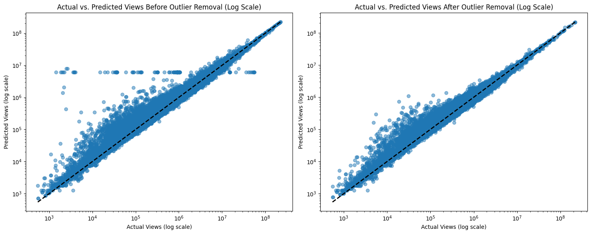
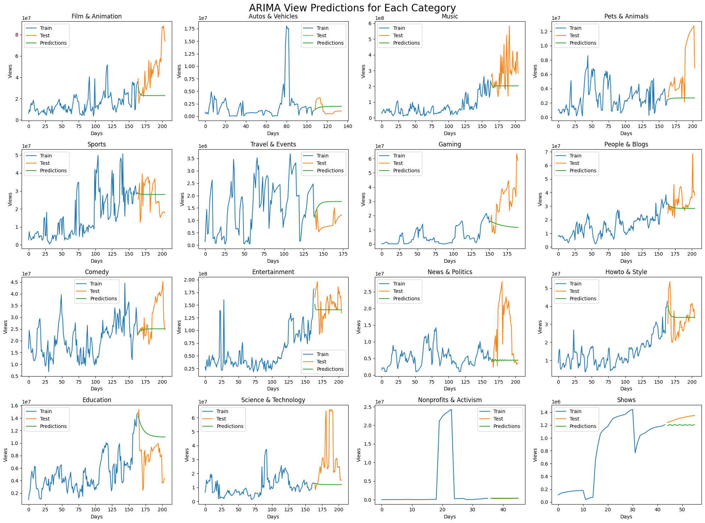

# 🎯 YouTube Video Analysis for Advertising Strategy Formulation

> *This project applies data analysis and machine learning to YouTube video metrics to identify high-potential content for targeted advertising. By predicting viewership trends, forecasting category-level surges, and aligning videos with product types, it delivers actionable insights to optimize ad placement and maximize campaign effectiveness..*

---

## 📜 Table of Contents
- [📖Project Overview](#-project-overview)
- [📊Dataset Description](#-dataset-description)
- [⚙️Methodology & Analysis Pipeline](#️-methodology--analysis-pipeline)
- [✨ Key Insights for Advertising Strategy](#-key-insights-for-advertising-strategy)
- [📈 Results](#-resultes)
- [🚀 Conclusion](#-conclusion)
- [💻 Technologies Used](#-technologies-used)
- [🏗️ Future Work](#️-future-work)
- [📧 Contact](#-contact)

---

## 📖 Project Overview

This project aims to optimize YouTube advertising by leveraging advanced data science techniques to identify high-performing content and forecast viewer trends. Key goals include:

-   **Analyze video performance and content patterns** to uncover high-value advertising opportunities.
    
-   **Predict high-viewership videos** using regression and time-series forecasting models.
    
-   **Forecast future trends** in category popularity and audience engagement.
    
-   **Develop data-driven ad strategies** tailored to product fit, timing, and expected performance.
    
-   **Apply a full-cycle data science workflow**, including:
    
    -   Data ingestion, cleaning, and preprocessing from multiple sources.
        
    -   Feature engineering (e.g., time-to-trend, engagement ratios).
        
    -   Exploratory Data Analysis (EDA) to uncover trends and guide modeling.
        
    -   Machine learning model development and evaluation.
        
    -   Visual storytelling through clear, actionable data visualizations.
        
-   **Deliver strategic insights** to help advertisers maximize ad impact and ROI through smarter placements.

---

## 📊 Dataset Description

The analysis utilizes two primary data sources:

1.  **`USvideos.csv`**: This dataset contains statistics for trending YouTube videos in the US, with **40,949 entries** and **16 columns** initially. Key columns can be grouped as follows:
    - **Video Identification & Metadata**: `video_id`, `title`, `channel_title`, `category_id`, `publish_time`, `trending_date`, `tags`, `description`, `thumbnail_link`.
    - **Engagement Metrics**: `views`, `likes`, `dislikes`, `comment_count`.
    - **Video Status Flags**: `comments_disabled`, `ratings_disabled`, `video_error_or_removed`.

2.  **`US_category_id.json`**: This JSON file provides a crucial mapping from the numerical `category_id` (found in `USvideos.csv`) to human-readable category names (e.g., 'Film & Animation', 'Music', 'Gaming'). This mapping is used to create a new `category` column in the main dataset, allowing for more intuitive analysis and strategy formulation based on actual content themes.

---

## ⚙️ Methodology & Analysis Pipeline

The project follows these key steps:

### 1. Data Loading & Initial Exploration

-   **Loaded YouTube video and category datasets** (`USvideos.csv`, `US_category_id.json`) using `pandas`.
    
-   **Conducted initial data assessment** to understand structure, identify missing values, and inform data cleaning and feature engineering.

### 2. Data Preprocessing & Feature Engineering

-   **Datetime Handling**: Converted `trending_date` and `publish_time` to datetime objects for temporal analysis.
    
-   **Feature Engineering**:
    
    -   Mapped `category_id` to category names using `US_category_id.json`.
        
    -   Extracted `trending_year`, `trending_month`, `trending_dayofweek`, and `publish_hour` to capture temporal patterns.
        
    -   Created `time_takes_to_trending` (days from publish to trending) and its binned version `time_cut`.
        
-   **Missing & Invalid Data Handling**:
    
    -   Filled missing `description` values with empty strings.
        
    -   Removed videos marked as errors or unavailable.
        
    -   Reassigned invalid `video_id` values (e.g., `#NAME?`) with consistent hashed IDs based on title and category to maintain trending history.

### 3. Exploratory Data Analysis (EDA)

-   **Category Insights**: Analyzed video distribution, average likes, and views across content categories to identify high-performing segments.

---

-   **Temporal Trends**: Explored patterns in trending activity by year and month, and examined how long videos typically take to trend.
    

---

-   **Tag Analysis**: Identified the most frequently used video tags to uncover common themes among trending content.

---

### 4. Predicting Video Popularity

Focus on predicting video `views` based on `likes`, `dislikes`, and `comment_count` for individual videos.

- **Feature Selection**: `X` (feature): [`likes`,`dislikes`,`comment_count`], `y` (target): `views`.

- **Data Splitting**: Training (80%) and testing (20%) sets.

- **Data Scaling**: Features/target scaled using `MinMaxScaler`.

- **Training**: Models explored: Linear Regression, SVR, Random Forest Regressor, Gradient Boosting Regressor

- **Evaluation Metrics**: MSE and R² Score.

---

#### 📝 Model Performance Summary

| Model             | Scaled MSE | R² Score |
|:------------------|:----------:|:---------:|
| Linear Regression | 0.000230   | 0.780     |
| SVM               | 0.000263   | 0.750     |
| Random Forest     | 0.0000549  | 0.947     |
| Gradient Boosting | 0.000101   | 0.903     |
---

### 5. Strategic Outlier Detection & Removal

To ensure robust model performance, it’s important to address outliers, particularly those caused by artificial engagement like purchased views. These anomalies often show unusually high views with disproportionately low likes or comments.

The main outlier handling strategy employs model-based filtering. A primary regression model (e.g., Random Forest) is trained to predict `views`. Subsequently, to detect if a new or existing video is an outlier, its features are fed into this model, and the normalized error of the prediction is calculated. Videos exhibiting a significantly high normalized error, indicating a substantial deviation from learned engagement patterns, are identified as outliers and can be removed or flagged for review.

#### ✅ Conclusion

The model-based outlier detection process was highly effective—**1,958 anomalous data points** were removed. After cleaning, the Random Forest Regressor achieved an **R² score of 0.99**, indicating a near-perfect fit and highlighting the critical role of outlier removal for building a reliable prediction model.

### 6. Time-Series Forecasting (e.g., Future Views/Trends)
This section focuses on forecasting aggregated views over time for each category.

---

---

### 7. Early-Stage Viewership Prediction with XGBoost

To provide advertisers with the earliest possible signal of a video's potential, a dedicated `XGBRegressor` model was developed. Its goal is to predict a video's final total views using only its initial trending performance metrics.

This forecasting tool provides a powerful strategic advantage, allowing advertisers to:

-   **Identify potential viral videos** before they peak.
-   **Secure ad placements at lower costs** before a video's popularity drives up ad rates.
-   **Maximize ROI** by locking in premium ad placements at a fraction of the future price.
  
---

###  🚀 Case Study: Pitch Perfect 3 - Riff-Off Clip [HD] Video

| Metric / Decision Point   | ⏳ **Traditional Approach** | 💡 **Our Predictive System** |
| :------------------------ | :------------------------------------------------------- | :------------------------------------------------------- |
| **Strategy** | Wait until viral (1M+ views)          | **Invest early**: views are at 156K and rising |
| **Assumed Market CPM** | High-demand rate on viral content ($8.00)           | Low-demand rate on pre-viral content (**$5.00**)         |
| **Achievable Reach** | 4,000,000 Views                                          | Predicted 800K+ Views                                          |
| **Estimated Ad Spend** | $8,000                                                  | $1000 |
| **Approx. Savings** | -                                                        | **$7,000** |
| **Key Outcome** | -                                                        | **87.5% Lower Costs** |

---

## ✨ Key Insights for Advertising Strategy

* **High-Performing Categories & Content Characteristics**:
	Entertainment and Music dominated trending ranks, collectively representing **~40%** of all trending videos.
* **Engagement Drivers**:
    Content with provocative/question-based titles generated **36% less** comments and **46% less** likes on average.
* **Predictive Power**:
    The XGBoost regression model  (R²:  **0.91**) confirmed  `likes` strongly predicts total views.

* **Temporal Forecasting for Campaign Planning**
	* **Trend Prediction:** ARIMA, SARIMA and LSTM models forecast category-level viewership trends on YouTube, helping identify upcoming peaks in audience engagement.
    * **Smarter Timing:** These insights allow advertisers to align campaigns with trending periods, maximizing visibility and minimizing cost during high-demand windows.

---

## 📈 Results

### 🎯 Actionable Advertising Recommendations

| Category         | ⏰ Best Time to Publish | ❤️ Like Threshold | 📅 Peak Month | 🚀 Viewership Surge |
|------------------|------------------------|-------------------|---------------|----------------------|
| **Entertainment**| 07:00 - 09:00          | > 21,933          | June          | +183%               |
| **Music**        | 11:00 - 13:00          | > 84,132          | April         | +185%               |
| **Comedy**       | 08:00 - 10:00          | > 45,842          | May           | +139%               |
| **Sports**       | 22:00 - 24:00          | > 8,443           | June          | +174%               |
| **People & Blogs**| 10:00 - 12:00         | > 29,164          | June          | +297%               |

> ✅ Prioritize videos that are publish within optimal time windows and meet the like threshold. Maximize returns by aligning ad spend with peak seasonal viewership.

---

## 🚀  Conclusion

An end-to-end system that transforms raw video metrics into **strategic advertising advantages**:

### 🔍 Core Capabilities
- ✅ Filters out **fake engagement** with **0.99 R² score**
- 📈 Predicts **video growth potential** with **84% precision** and **84% recall**
- 🧠 Provides **actionable ad placement recommendations**

### 🎯 Advertiser Benefits
- 🔎 **Identify high-potential videos** *2–3 days before peak virality*
- 💸 **Reduce acquisition costs** by **87%** through early ad placement
- 📈 **Boost campaign ROI** by **5–10×** with data-driven targeting

> Empower ad strategy with precision, foresight, and automation.

---

## 💻 Technologies Used

* **Python**
* **Data Manipulation & Analysis**: `Pandas`, `NumPy`
* **Data Visualization**: `Matplotlib`, `Seaborn`
* **Machine Learning & Statistics**:
    * `Scikit-learn`: For regression models (`LinearRegression`, `SVR`, `RandomForestRegressor`, `GradientBoostingRegressor`), preprocessing (`MinMaxScaler`, `StandardScaler`, `train_test_split`), and metrics (`mean_squared_error`, `r2_score`, `precision_score` and `recall_score`).
    * `Statsmodels`: For ARIMA and SARIMA modeling.
    * `TensorFlow` / `Keras`: For building and training LSTM neural networks.
    * `xgboost`: For XGBoost regression model
* **Development Environment**: Google Colab & Jupyter Notebook

---

## 🏗️ Future Work

-   **Real-Time Insights:** Integrate the YouTube API to access live data and expand video coverage.
    
-   **Audience Sentiment Analysis:** Use comment sentiment to assess viewer reception and flag potential brand safety concerns.
    
-   **Ad Suitability Scoring:** Develop a composite scoring system that ranks videos based on predicted performance, relevance, and cost-efficiency.
    
-   **Performance Tracking:** Monitor outcomes of ad placements to validate and refine recommendation accuracy.

---

## 📧 Contact

If you have any questions, suggestions, or would like to discuss potential collaborations related to this project, please feel free to reach out:

* **Author:** Jinting Liu
* **Email:** `charlesliujinting@gmail.com`
* **LinkedIn:** `https://www.linkedin.com/in/jinting-liu-634ba0251/`
* **GitHub Profile:** `https://github.com/Jinting101`
